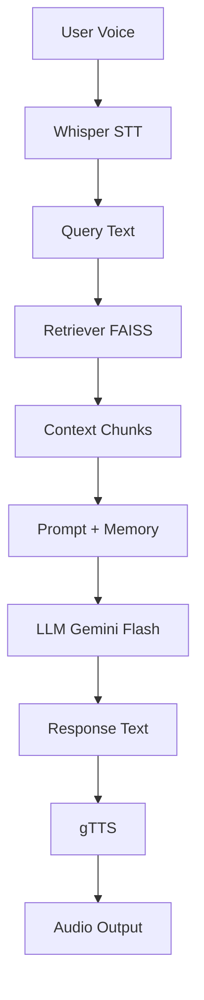

# 🎙️ Voice AI Agent (RAG-based)

A multilingual voice assistant that answers user queries using Transight website data via a Retrieval-Augmented Generation (RAG) pipeline.

---

## 🚀 Architecture



---

## ⚙️ Pipelines

### Knowledge Base


### Query (RAG)


---

## 📁 Structure

```
voice_agent/
├── scrape/          # Data ingestion
├── embeddings/      # Embedding + FAISS
├── rag/             # Retrieval + generation
├── conversation/    # Memory
├── audio/           # STT + TTS
├── data/            # Raw + processed data
├── main.py
```

---

## ⚡ Setup (using uv)

Install uv (if not installed):

```
curl -Ls https://astral.sh/uv/install.sh | sh
```

Create environment & install deps:

```
uv venv
uv pip install -r requirements.txt
```

Run:

```
uv run python main.py
```

Set API key:

```
export GEMINI_API_KEY=your_key_here
```

---

## ⚖️ Key Tradeoffs

| Component | Choice         | Reason                        |
| --------- | -------------- | ----------------------------- |
| LLM       | Gemini Flash   | Fast, multilingual            |
| Vector DB | FAISS          | Simple, local                 |
| STT       | Whisper        | Offline, reliable             |
| TTS       | gTTS           | Easy, multilingual            |
| Data      | Manual curated | Clean, avoids scraping issues |

---

## ⏱️ Latency

~5–6 seconds total (STT + LLM dominate)

---

## 🧠 Notes

* Model-agnostic design (LLM can be swapped)
* Responses are grounded in retrieved context
* Output language matches user input

---

## 🚀 Future Work

* Streaming STT
* Better TTS (neural voices)
* Scalable vector DB (Pinecone)

---
